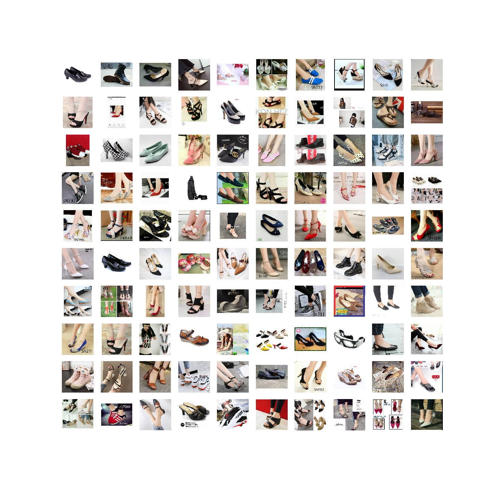
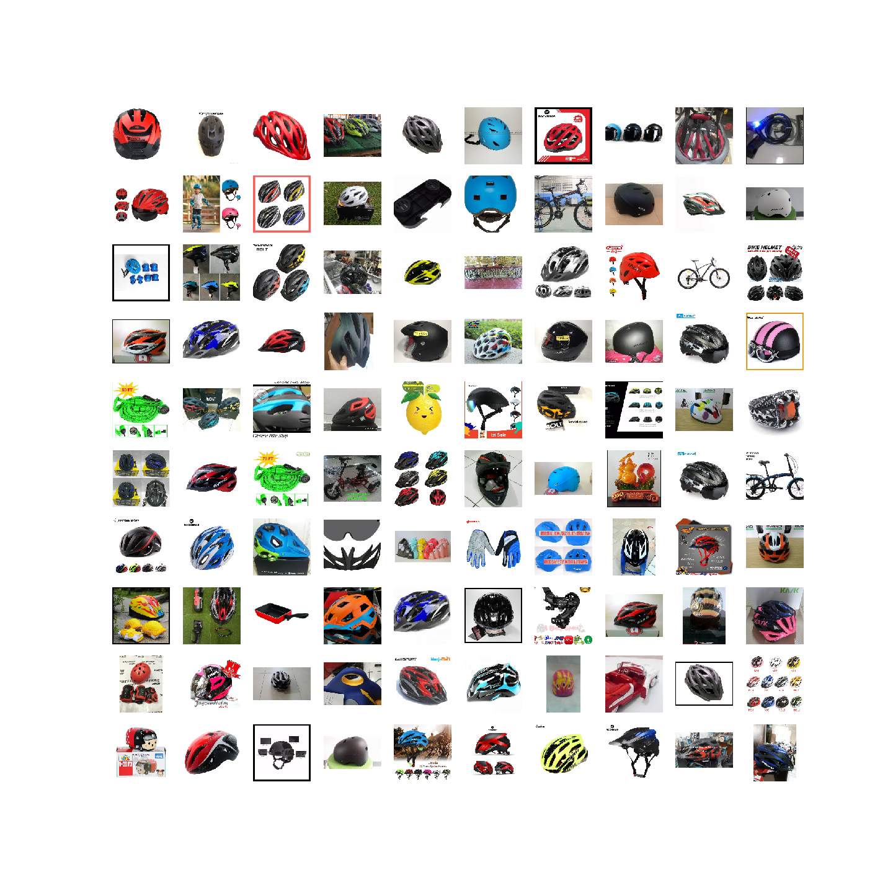
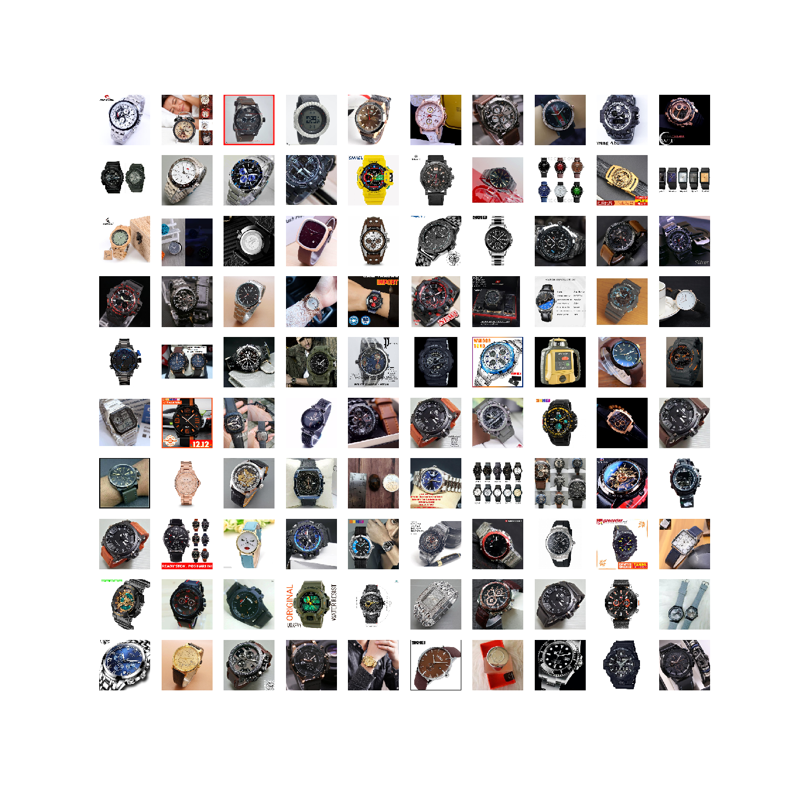

<h1 align="center"> Product Detection using CNN Transfer Learning </h1>  

## Introduction

Welcome to my project for multi-class image product detection using Convolutional Neural Networks and Transfer Learning techniques.

The dataset is from an e-commerce site coding competition (not provided), and I will be demonstrating the utility of using CNN models in classifying thousands of images into over 40 classes of products.

I will be exploring a variety of pre-trained models traditionally used in the CNN literature, and will be running further experiments by varying elements such as image augmentation, fine tuning specific layers in the CNN and retraining all the weights of the CNN architecture.

These experiments will allow us to understand when and how transfer learning works best. For instance, the choice to re-train all the weights, or to un-freeze very specific layers, is dependent on factors such as amount of data, compatibility of classification between pre-trained data and your own data etc.

## Results

By implementing the CNNs in the given notebook, I have produced image groups of test results, which provide a quick confirmation of model effectiveness.

Here are some examples below:

**Category 17 (presumably ladies' shoes)**

**Category 22 (presumably helmets)**

**Category 24 (presumably watches)**

